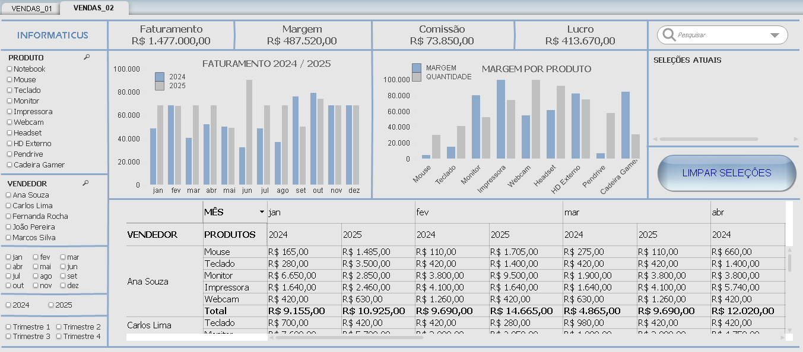
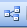

# 📌 Projeto BI – Loja de Informática (QlikView)

## 📌 Visão Geral

Este projeto tem como objetivo desenvolver um dashboard interativo em QlikView para análise de vendas de uma loja de informática, permitindo o 
acompanhamento de indicadores estratégicos como faturamento, volume de vendas e produtos mais vendidos.

O projeto foi construído seguindo boas práticas de BI, com:

* Modelagem de dados adequada
* Scripts de carga organizados
* KPIs claros
* Visualizações interativas
* Documentação completa para reprodução do ambiente

---

## 📌 Contexto do Negócio

A loja de informática comercializa produtos como:

* Impressoras
* Periféricos (mouse, teclado, monitores)
* Componentes de hardware
* Acessórios e suprimentos

O gestor precisa responder perguntas como:

* Qual o faturamento mensal, trimestral e anual?
* Quais produtos vendem mais?
* Quantidade de vendas por vendedor
* Comissão
* Margem
* Lucro

---

## 📌 Objetivos do Projeto

* Criar um painel gerencial de vendas
* Facilitar a tomada de decisão
* Padronizar indicadores de desempenho
* Demonstrar domínio prático do QlikView

---

## 📌 Tecnologias Utilizadas
| Tecnologia | Descrição |
| ---------- | --------- |
| QlikView Desktop | Plataforma de Business Intelligence (BI) | 
| Stack XAMPP | Banco de Dados SQL (fonte de dados) |
| Conector ODBC | Conexão com o banco de dados (extração) |
| Git/GitHub | Versionamento |

---

## 📌 Estrutura do Projeto

```
dashboard-qlikview-informaticus/
│
├── carregamento/
│   └── carregamento.qvw
│
├── dados_qvd/
│   ├── produto_qvd.qvd
│   ├── vendas_qvd.qvd
│   ├── vendas_transformada_qvd.qvd
│   └── vendedor_qvd.qvd
│
├── extracao/
│   └── extracao.qvw
│
├── fonte/
│   └── loja_info.sql
│
├── imagens/
│   ├── vendas_01.png
│   └── vendas_02.png
│
├── transformacao/
│   └── transformacao.qvw
│
├── visualizacao/
│   └── visualizacao.qvw
│
├── LICENSE
└── README.md
```

---

## 📌 Modelo de Dados (Associativo)

O modelo de dados segue o padrão estrela simplificada, utilizando:

* Vendas como tabela fato
* Produtos, Vendedor e Calendário como dimensões

---

## 📌 KPIs Desenvolvidos

* Faturamento Total
* Comissão
* Margem
* Lucro

---

## 📌 Documentação Adicional

* Prints dos Dashboards: pasta imagens/

---

## 📌 Imagens




---

## 📌 Como Baixar e Instalar o QlikView

### 1️⃣ Download do QlikView

1. Acesse o site oficial da Qlik:
```
https://www.qlik.com
```
2. Vá em Produtos → QlikView
3. Faça login ou crie uma conta gratuita
4. Baixe o QlikView Desktop (Personal Edition)<br>
💡 A versão gratuita permite abrir e editar arquivos .qvw localmente.

### 2️⃣ Instalação

* Execute o instalador
* Siga as instruções padrão
* Reinicie o computador se solicitado

---

## 📌 Clonar o Repositório

```
git clone https://github.com/jcarlossc/dashboard-qlikview-informaticus.git
cd dashboard-qlikview-informaticus
```
* Ou faça o download do projeto em .zip.

---

## 📌 Abrir o Projeto no QlikView

1. Abra o QlikView Desktop
2. Clique em File → Open
3. Selecione o arquivo:
```
visualizacao/visualizacao.qvw
```
4. Caso o dashboard não seja executado:
* Clique em  Recarregar
* Caso tenha curiosidade, clique em  Visualizador de tamelas, para visualizar a estrutura de tabelas.

---


